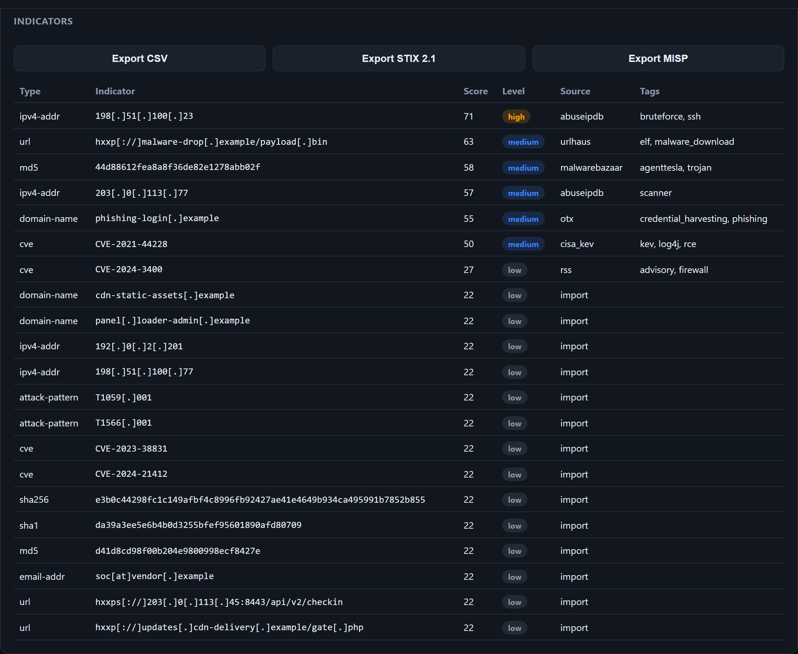

# Cyber Security Threat Intelligence Platform

[](https://github.com/mojtaba-py-code/cyber-threat-intelligence-platform/actions/workflows/ci.yml)
[](.github/workflows/ci.yml)
[](https://www.python.org/)
[](https://fastapi.tiangolo.com/)
[](pyproject.toml)
[](https://github.com/astral-sh/ruff)
[](docs/security.md)
[](LICENSE)

A modular, security-first platform to **collect, enrich, score, correlate and
visualise** cyber threat intelligence — a simplified, self-hostable Threat
Intelligence Platform (TIP) built with FastAPI, async SQLAlchemy, PostgreSQL,
Redis and Celery, following clean architecture and SOLID principles.

> **Offline-first & safe by default.** Collectors and enrichers make **no
> outbound network calls** until an operator sets `ENABLE_LIVE_COLLECTORS=true`;
> until then they serve bundled sample intelligence. Any fetch of a
> user-supplied URL is screened by an **SSRF guard** that blocks private,
> loopback, link-local and cloud-metadata destinations.

---

## Highlights

- **Indicator engine** — parse, **refang** (`hxxp://evil[.]com` → real form),
  classify (IPv4/IPv6, domain, URL, MD5/SHA1/SHA256, email, CVE, ATT&CK
  technique) and **defang** for safe display.
- **Ingest whole documents** — paste a vendor report, a CSV export or a STIX
  bundle and the extractor harvests every indicator in it (defanged forms
  included), skipping filenames like `payload.exe`. Preview first
  (`POST /iocs/extract`), then import (`POST /iocs/bulk`).
- **Pluggable collectors** for AbuseIPDB, URLHaus, MalwareBazaar, AlienVault
  OTX, CISA KEV and RSS advisories — offline samples out of the box, real APIs
  when keys are supplied. Adding a source is a one-line registry entry.
- **Enrichment** — GeoIP/ASN, DNS and reputation facets (deterministic offline
  heuristics; live resolution when enabled), all behind the SSRF guard.
- **Transparent threat scoring** — a pure, weighted 0–100 engine (source
  corroboration, detection ratio, recency, frequency, geo/port risk,
  confidence) that returns a level **and per-signal contributions** for
  explainability.
- **Correlation graph** — relationships (`resolves-to`, `communicates-with`,
  `drops`, `exploits`, `attributed-to`, …) stored as edges and traversed
  in-process with networkx: neighbours, pivots, attack chains, graph export.
- **Alerting, live** — rules (`new_ioc`, `threat_score` thresholds) are evaluated
  automatically on every ingest; matches create alerts and deliver to the `log`
  channel or an operator-set webhook (behind the SSRF guard). Full rule CRUD, an
  alert feed, and a **Server-Sent Events stream** (`GET /stream/alerts`) that
  pushes alerts to the dashboard the moment they fire.
- **Standards-based sharing** — export any filtered result set as a **STIX 2.1**
  bundle (indicator/vulnerability/attack-pattern SDOs with deterministic UUIDv5
  ids, so consumers deduplicate) or a **MISP** event, alongside JSON/CSV/Markdown.
- **Threat-actor profiles** — APT/ransomware/nation-state groups with aliases,
  motivations, MITRE techniques, known malware and targets.
- **Security** — Argon2id passwords, JWT access/refresh with **rotation +
  logout revocation** (access tokens revocable, checked per request), **API
  keys** (hashed, prefix-identified; disabled with their owner), RBAC
  (viewer/analyst/admin), per-account **lockout**, rate limiting, security
  headers, secret encryption at rest, structured logging with redaction.
- **REST API** (FastAPI + OpenAPI/Swagger/ReDoc), **dashboard** (served under a
  strict nonce-based CSP), Docker/Compose/Nginx, Celery workers + beat, Alembic, CI.

---

## The dashboard

Running offline, with the bundled sample intelligence and one pasted vendor
report. Every alert below arrived over the `/stream/alerts` SSE connection while
the page was open — the rules are evaluated on ingest, not on a poll.


Indicators are stored defanged, scored 0–100 with an explainable breakdown, and
exportable as CSV, STIX 2.1 or a MISP event:



---

## Architecture

```
 HTTP ─▶ FastAPI routers + DI ─▶ Services ─▶ Repositories ─▶ PostgreSQL
                │                   │  │  │
                │                   │  │  └─▶ Correlation graph (networkx)
                │                   │  └────▶ Enrichment engine ─▶ SSRF guard
                │                   └───────▶ Scoring engine (pure)
                ▼
        Collectors (offline-first) ──▶ AbuseIPDB · URLHaus · OTX · KEV · RSS · …
        Celery workers/beat ◀── Redis (broker + cache)
```

Strict layering: **routers → services → repositories → models**. Services depend
on abstractions (the `Collector` port, repository classes), never on a concrete
provider or SQL. See [`docs/architecture.md`](docs/architecture.md).

---

## Quick start (local, no database required)

```bash
python -m venv .venv
# Windows: .venv\Scripts\activate  |  Unix: source .venv/bin/activate
pip install -e ".[dev]"

cp .env.example .env
python -m app.scripts.gen_keys      # paste the two keys into .env

DATABASE_URL="sqlite+aiosqlite:///./dev.db" uvicorn app.main:app --reload
```

- **Dashboard:** http://localhost:8000/dashboard
- **Swagger UI:** http://localhost:8000/docs · **ReDoc:** /redoc

## Full stack with Docker

```bash
cp .env.example .env && python -m app.scripts.gen_keys   # fill in .env
docker compose up --build
```

Starts PostgreSQL, Redis, the API, a Celery worker + scheduler, and Nginx. Only
Nginx is published — the database and cache stay on the internal network, and
Compose refuses to start until `POSTGRES_PASSWORD` and `REDIS_PASSWORD` are set.

---

## Example: submit, enrich, score, correlate

```bash
BASE=http://localhost:8000/api/v1
curl -s -X POST $BASE/auth/register -H 'Content-Type: application/json' \
  -d '{"email":"you@example.com","password":"a-strong-password"}'
TOKEN=$(curl -s -X POST $BASE/auth/login -H 'Content-Type: application/json' \
  -d '{"email":"you@example.com","password":"a-strong-password"}' | jq -r .access_token)

# Submit a DEFANGED URL — it is refanged, classified, enriched, scored, stored.
curl -s -X POST $BASE/iocs -H "Authorization: Bearer $TOKEN" \
  -H 'Content-Type: application/json' \
  -d '{"value":"hxxp://malware-drop[.]example/x.bin","source":"urlhaus"}'

# Run a collector (offline → bundled samples; live when enabled)
curl -s -X POST "$BASE/collectors/urlhaus/run?limit=25" -H "Authorization: Bearer $TOKEN"

# Pivot the correlation graph around the URL
curl -s "$BASE/correlation/pivot?ioc_type=url&value=http://malware-drop.example/x.bin" \
  -H "Authorization: Bearer $TOKEN"

# Import an entire report — every indicator in it, in one call
curl -s -X POST $BASE/iocs/bulk -H "Authorization: Bearer $TOKEN" \
  -H 'Content-Type: application/json' \
  -d '{"content":"Loader beaconed to hxxp://c2[.]example/gate.php and 198[.]51[.]100[.]88 (CVE-2024-21412)","source":"incident42"}'

# Export for sharing: CSV for humans, STIX 2.1 / MISP for machines
curl -s "$BASE/reports/iocs.csv?min_score=50"  -H "Authorization: Bearer $TOKEN"
curl -s "$BASE/reports/iocs.stix?min_score=50" -H "Authorization: Bearer $TOKEN"
curl -s "$BASE/reports/iocs.misp"              -H "Authorization: Bearer $TOKEN"

# Watch alerts arrive live (Server-Sent Events)
curl -N "$BASE/stream/alerts" -H "Authorization: Bearer $TOKEN"
```

Machine access uses an API key instead of a bearer token:

```bash
curl -s -X POST $BASE/auth/api-keys -H "Authorization: Bearer $TOKEN" \
  -H 'Content-Type: application/json' -d '{"name":"soc-automation"}'   # returns the raw key ONCE
curl -s $BASE/iocs -H "X-API-Key: tip_..."
```

---

## Configuration

| Variable | Default | Meaning |
| --- | --- | --- |
| `ENABLE_LIVE_COLLECTORS` | `false` | Master switch for outbound collection/enrichment. |
| `OUTBOUND_ALLOWED_HOSTS` | *(empty)* | Extra SSRF allow-list for user-URL fetches. |
| `MASTER_ENCRYPTION_KEY` | — | Fernet key for encrypting stored provider keys (prod-required). |
| `JWT_SECRET_KEY` | — | HS256 signing secret (prod-required, ≥ 32 chars). |
| `ABUSEIPDB_API_KEY`, `OTX_API_KEY`, … | — | Provider keys (only used when live). |
| `DATABASE_URL` | postgres… | Async SQLAlchemy DSN. |
| `TRUSTED_PROXY_CIDRS` | *(empty)* | Networks whose `X-Forwarded-For` may be believed. Set to your proxy's network — leaving it empty behind Nginx puts every caller in one rate-limit bucket. |
| `EXPOSE_API_DOCS` | `true` | Serve `/docs` and `/openapi.json`. Forced off in production. |
| `POSTGRES_PASSWORD`, `REDIS_PASSWORD` | — | Required by Compose; no defaults, on purpose. |

In `production`, the app refuses to start without a master key, a strong JWT
secret, `APP_DEBUG=false`, and a non-wildcard CORS list.

---

## Development

```bash
pytest --cov=app --cov-report=term-missing   # tests + coverage
ruff check app tests && ruff format --check app tests
mypy app
```

Migrations: `alembic upgrade head` (the `api` container runs this on start)
Background jobs: `celery -A app.workers.celery_app.celery worker` / `... beat`

---

## Documentation

- [Architecture](docs/architecture.md) · [Security model](docs/security.md) · [Deployment](docs/deployment.md)

## Project layout

```
app/
  api/          FastAPI routers, DI, middleware, error handlers
  collectors/   Collector port + offline-first providers + factory + samples
  config/       validated settings
  core/         exceptions, logging, resilience, SSRF guard
  correlation/  in-process threat graph (networkx)
  database/     async engine/session, declarative base
  enrichment/   enrichers + engine (→ scoring signals)
  ioc/          indicator parsing / (de)fang / types
  models/       SQLAlchemy models
  repositories/ persistence (repository pattern)
  schemas/      Pydantic request/response contracts
  scoring/      threat-scoring engine (pure)
  security/     crypto, JWT, API keys, RBAC, throttle, token store
  services/     business logic (service layer)
  web/          single-file dashboard
  workers/      Celery app + tasks
tests/          unit + integration tests
```

## Disclaimer

Provided for educational, research and defensive security use. Sample indicators
use RFC 5737 documentation ranges and `.example` domains and are not real
threats. Operate live collectors and API keys responsibly and within the terms
of each provider.

## License

MIT
